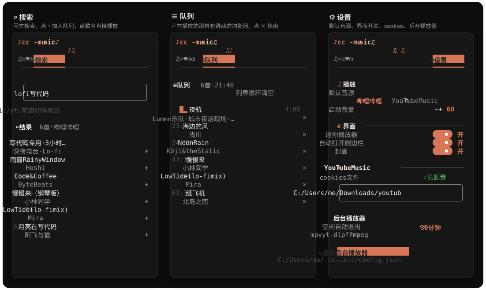

# cc-music

**写代码的时候，让 Claude 顺手放首歌。**

敲一句 `/music 晴天 周杰伦`，或者直接跟 Claude 说“来点适合写代码的歌”，音乐就在后台响起来了。你接着写你的代码，它接着放它的歌。



## 都有些什么

- **点歌、切歌、调音量**：搜索、播放、暂停、上一首下一首、拖进度、单曲循环，一条命令搞定。
- **侧边栏播放器**：块字符画的封面、跟着节奏跳的音符、频谱动画，还有卡拉 OK 式逐字染色的歌词。
- **迷你播放器**：常驻输入框上方，瞄一眼就知道在放什么，顺手就能暂停。
- **队列、收藏、历史**：搜到喜欢的，立刻播放或者排到后面，听过的都有记录。
- **动嘴就行**：Claude 会调用插件的 `music` 工具，命令记不住也没关系。
- **两个音源**：默认哔哩哔哩，国内直连；也能用 YouTube Music。

播放器是一个独立的后台进程：Claude Code 关了、插件热重载了，音乐都不停，几个会话还能共用一个播放器。没在放歌且 30 分钟没人理它，它会自己退出；想马上关掉就 `/music quit`。

## 安装

### 1. 先备好这几样

| 软件 | 版本 | 干什么用 |
| --- | --- | --- |
| Claude Code | 2.1.288+（支持 mods） | 加载命令、工具和播放器界面 |
| Node.js | 22.18+ | 跑后台播放器 |
| mpv | 最新即可 | 真正出声的那个 |
| yt-dlp | 越新越好 | 从音源页面取音频 |
| ffmpeg | 可选，强烈推荐 | 画封面 |

Windows 用户有 [Scoop](https://scoop.sh/) 的话，一行搞定：

```powershell
scoop install mpv yt-dlp ffmpeg
# Node.js 版本不够的话再加上：
scoop install nodejs-lts
```

装完重开一下终端，`node --version`、`mpv --version`、`yt-dlp --version` 都能跑就妥了。

### 2. 从插件市场安装（推荐）

在 Claude Code 里输入：

```text
/plugin marketplace add ccckfg/cc-music
/plugin install cc-music@cc-music
```

界面、后台和 npm 依赖会一起装好。重开一个会话，来一首试试：

```text
/music 晴天 周杰伦
```

第一次会顺便把后台播放器拉起来，稍等几秒就响了。

### 懒人法：让 agent 帮你装

把这句话丢给 Claude Code 或任何能跑命令的 coding agent：

```text
帮我安装 https://github.com/ccckfg/cc-music：检查 Claude Code、Node.js（>= 22.18）、mpv、yt-dlp、ffmpeg 是否就绪，缺什么先告诉我；然后通过插件市场添加 ccckfg/cc-music 并安装 cc-music@cc-music，装好后提醒我重开会话。
```

### 从源码跑

```sh
git clone https://github.com/ccckfg/cc-music.git
cd cc-music
npm ci
claude --plugin-dir .
```

`.` 就是仓库根目录，整个仓库就是一个插件。

## 开始听歌

### 点歌

```text
/music 晴天 周杰伦
/music bili:稻香 周杰伦
/music yt:Yellow Coldplay
```

直接播放第一个搜索结果。“歌名 + 歌手”最准。

想挑一挑再放：

```text
/music search 晴天 周杰伦
/music 2
```

序号就是刚才那次搜索的结果。点歌会插在当前这首后面并马上切过去，原来的队列一首不少。

或者干脆跟 Claude 聊：

```text
放点周杰伦的歌。
把稻香加入队列。
下一首，音量调到 40。
现在放的是什么？帮我收藏。
```

### 打开面板

输入 `/music`，点上面的图标在**正在播放、搜索、队列、收藏、历史、设置**之间切换。



- 点歌名直接播放，点 `+` 排到队尾，点 `×` 移出队列。
- 进度条和音量条都能点、能拖。
- 胶囊按钮暂停 / 继续，心形收藏，循环图标切换模式。
- 键盘党：Tab 切换控件，回车按下；选中标签栏、播放控制或音量条后，← → 切标签、切歌、调音量，空格暂停。
- 迷你播放器：`Ctrl+X` 再按 Tab 选中它，然后 `b` / `p` / `n` / `o` 分别是上一首 / 暂停 / 下一首 / 打开面板。

**想让面板停在右边当侧边栏？** 全屏布局下把终端拉到 110 列以上就行，窄了它会待在输入框上方。全屏布局下点歌时侧边栏会自动弹出来，不喜欢可以在设置里关掉。

封面是用块字符一格一格画出来的，侧边栏越宽、终端越高，封面越清楚。

### 命令速查

| 命令 | 作用 |
| --- | --- |
| `/music` | 打开面板 |
| `/music <歌名>` | 搜索并播放第一个结果 |
| `/music search <歌名>`、`/music <序号>` | 先搜，再挑一首放 |
| `/music add <歌名\|序号\|all>` | 排到队尾，`all` 是把刚搜到的全排上 |
| `/music pause` / `resume` / `toggle` | 暂停 / 继续 / 切换 |
| `/music next` / `prev` / `stop` | 下一首 / 上一首 / 停止 |
| `/music vol 40`、`/music vol +10` | 音量（0–100），可以加减 |
| `/music seek 1:30`、`/music seek +10` | 跳到某个时间，或前后跳几秒 |
| `/music repeat off` / `all` / `one` | 不循环 / 列表循环 / 单曲循环 |
| `/music queue` / `jump <n>` / `remove <n>` / `clear` | 看队列 / 跳到第 n 首 / 移除 / 清空 |
| `/music lyrics` | 当前歌词 |
| `/music fav` / `favs` / `history` | 收藏当前这首 / 看收藏 / 看历史 |
| `/music show` / `hide` | 显示 / 隐藏迷你播放器 |
| `/music providers` / `status` | 音源列表 / 播放状态 |
| `/music restart` | 重启后台，队列和进度都保留，升级后用它 |
| `/music quit` | 关掉后台播放器 |

## 设置

点标签栏最右边的 **⚙**：

- **播放**：默认音源、启动音量。
- **界面**：迷你播放器、点歌时自动开侧边栏、封面，三个开关，下次会话还记得。
- **YouTube Music**：填 cookies 文件路径，回车保存，顺便告诉你文件在不在。
- **后台播放器**：空闲多久退出（0 是永不退出）、mpv / yt-dlp / ffmpeg 找到没、一键重启。

这些设置存在 `~/.cc-music/config.json`，也可以直接改文件：

| 字段 | 默认值 | 说明 |
| --- | --- | --- |
| `defaultProvider` | `bilibili` | 默认音源，可选 `ytmusic` |
| `volume` | `60` | 启动音量 |
| `mpvPath` / `ytdlpPath` / `ffmpegPath` | 自动找 | 找不到时手动填完整路径 |
| `jsRuntime` | `node` | 给 yt-dlp 解析 YouTube 用 |
| `cookiesFile` | 空 | cookies.txt 路径 |
| `cookiesFromBrowser` | 空 | 从浏览器读 cookies，比如 `firefox` |
| `idleExitMinutes` | `30` | 空闲多久退出，0 不退出 |

手动改完文件 `/music restart` 一下就生效。收藏和历史在 `~/.cc-music/library.json`，日志在 `~/.cc-music/daemon.log`。

还有几个环境变量给折腾党：`CC_MUSIC_HOME` 换数据目录，`CC_MUSIC_NODE` 指定 Node.js，`CC_MUSIC_DAEMON` 指定 `daemon/src/launch.ts`。

## 遇到问题

**输入 `/music` 没反应**

到 `/plugin` 里看看 cc-music 启用了没有，然后重开会话。

**后台起不来，提示找不到 mpv / yt-dlp**

确认它们在 `PATH` 里，或者在配置里填上完整路径。设置页的「后台播放器」能看到哪个没找到，详细原因在 `daemon.log`。

**YouTube 搜得到，放不出来，说要“确认你不是机器人”**

这是 YouTube 在拦你的网络出口（挂代理时很常见）。给 yt-dlp 喂一份登录过的 cookies 就好：

1. 浏览器里登录 YouTube，用扩展（比如 Get cookies.txt LOCALLY）导出 `cookies.txt`。
2. 在设置页填上它的完整路径，回车，然后 `/music restart`。
3. 或者把 `cookiesFromBrowser` 设成 `firefox`，再不行就换个代理节点。

**没封面、没歌词**

封面要靠 ffmpeg，记得装上。歌词来自 [LRCLIB](https://lrclib.net)，冷门歌、现场版、纯音乐可能找不到。B 站的标题会先去掉【标签】、提取《歌名》再搜，还会按时长挑最接近的版本。

**怎么更新、怎么卸载**

更新：`/plugin marketplace update cc-music`，再到 `/plugin` 里更新 cc-music，重开会话后 `/music restart`。

卸载：先 `/music quit`，再 `/plugin uninstall cc-music@cc-music`。`~/.cc-music` 里的收藏和历史会留着，想彻底清掉就手动删。

## 开发与扩展

```text
cc-music/
├─ .claude-plugin/   插件清单、市场清单、Claude Code 生成的类型
├─ hooks/            命令、模型工具、状态、面板与迷你播放器
│  └─ fx/            绘制线程上的动画和可点的控件
├─ daemon/src/       本机 HTTP 接口、队列、配置和 mpv IPC
│  ├─ providers/     哔哩哔哩、YouTube Music 音源
│  └─ lyrics/        歌词来源
├─ types/            插件端的数据类型
├─ tests/            Claude Code 插件测试
└─ docs/images/      README 里的配图
```

数据怎么走：Claude Code mod → 本机 HTTP（带随机 token，只听 `127.0.0.1`）→ daemon → mpv JSON IPC → yt-dlp 取音频。

```sh
npm ci
npm test             # 加载插件并跑测试，顺便生成 Claude Code 类型
npm run check        # 类型检查 + 清单校验 + 测试，一条龙
npm run daemon       # 前台跑后台播放器，调试用
```

`tsconfig.json` 继承 Claude Code 生成的 `.claude-plugin/types/tsconfig.json`，刚克隆下来先跑一次 `npm test` 或 `claude --plugin-dir .` 把它生成出来。

开发时用 `claude --plugin-dir .`，改完自动热重载。Windows 上别用 junction 把目录链进会话的 mods 目录，热重载会看不到改动。

- 加音源：实现 `daemon/src/providers/types.ts` 里的 `MusicProvider`，在 `providers/index.ts` 注册。yt-dlp 支持的网站基本都能接。
- 加歌词来源：实现 `daemon/src/lyrics/types.ts` 里的 `LyricsProvider`，在 `lyrics/index.ts` 注册。
- 面板怎么画在 `hooks/view.tsx`，状态和事件在 `hooks/register.tsx`。沙箱里的 `$` 只能在 hook 里直接用，别传给别的函数。

mpv 的控制方式参考了 [youtube-music-cli](https://github.com/involvex/youtube-music-cli)，感谢！
